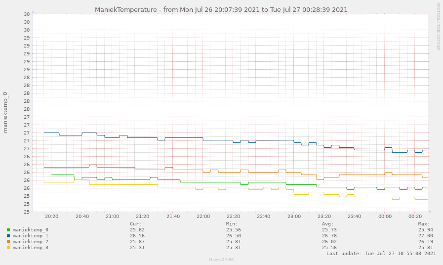

# maniekTemperature
<a href="http://munin-monitoring.org/">munin</a> plugin to monitor temperatures from Maniek custom temperature device



## INSTALL
* Set the tty device (`$tty=` line).
* Copy the file to `/etc/munin/plugins` (or to `/usr/share/munin/plugins/` and then `ln -s /usr/share/munin/plugins/maniekTemperature /etc/munin/plugins/`).
* Check if $tty is accessible by munin (you can do it by running the plugin like munin does: `munin-run maniekTemperature`), if not allow for it (for example with `chmod 666 /dev/ttyUSB0`).

## Arduino SCRIPTS
* Use `ds18b20.ino` if you don't want nrf24l01 support
* or use `ds18b20_rf24.ino` to transmit data with nrf24l01 to the...
* ...`ds18b20_rf24_receiver.ino` - no ds18b20 support here, just copying data received with nrf24l01 to the serial port

## ABOUT Maniek custom temperature device
```
==========================================================
Pomoc dla czujnika temperatury
showtemp - pokazuje temperature
showaddr - pokazuje adresy czujników temp. w kolejności
start - automatyczne włączenie wypisywania temperatur
stop - zatrzymanie automatycznego wypisywania temperatur
delay=<s> - czas odczytów w tyrbie auto od 1 do 255 (sekund)
save - zapisuje aktualne ustawienia
==========================================================
```

## REQUIREMENTS
* Munin
* PHP
* Arduino
* DS18B20 sensor(s)
* optional: second Arduino and two nRF24L01 transceivers
